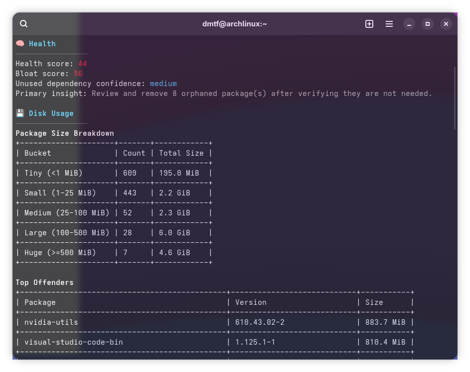
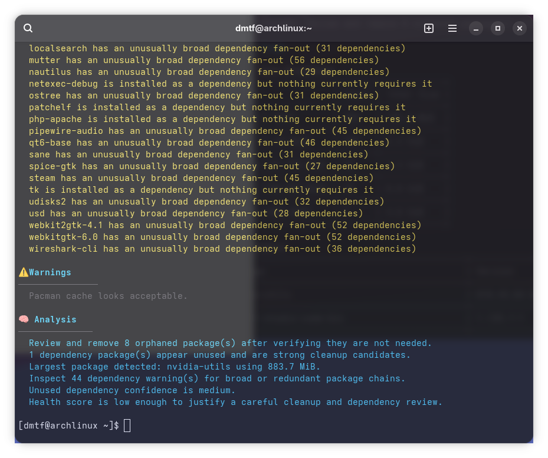
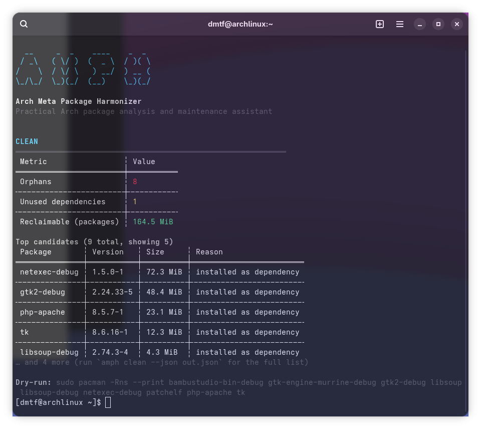
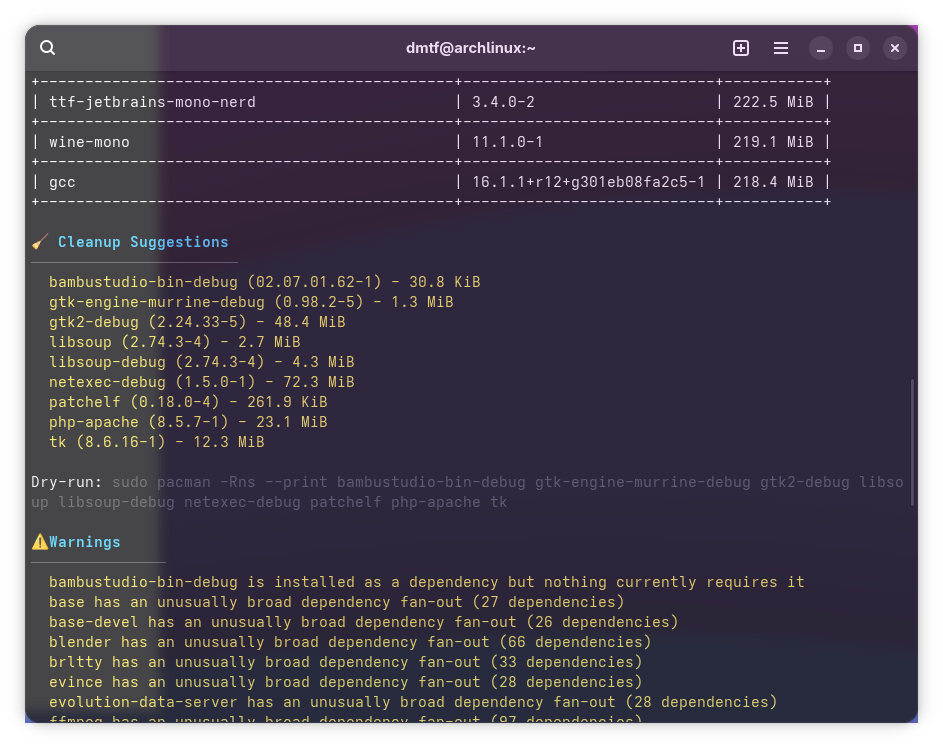
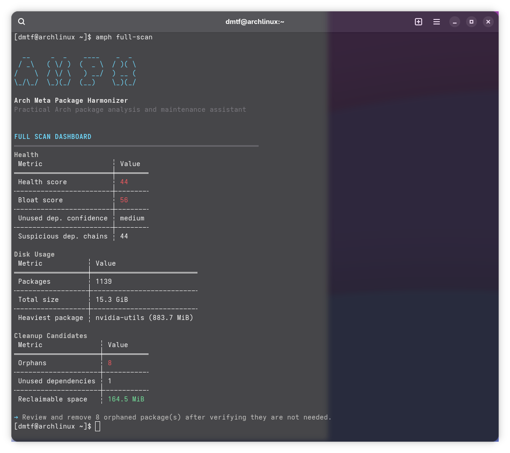
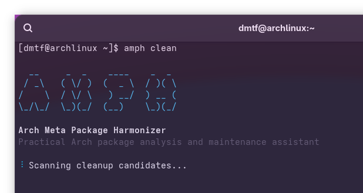
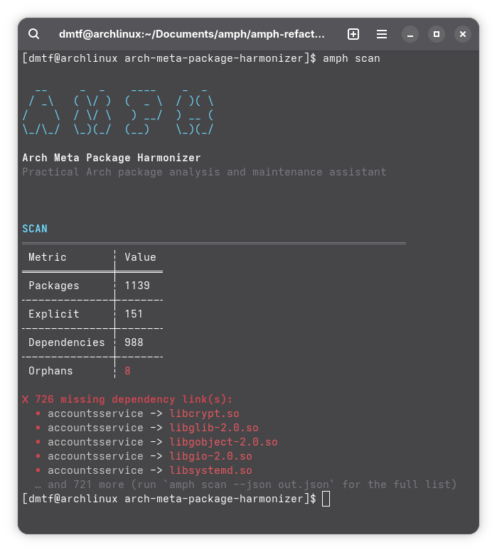

# amph - Arch Meta Package Harmonizer

`amph` is a terminal assistant for Arch Linux and Arch-based systems. It inspects installed packages, highlights missing dependencies, estimates cleanup opportunities, analyzes disk usage, and produces compact reports that are easier to act on than raw `pacman` output.

## What it does

- `scan` for a fast health snapshot with package counts, orphan detection, cache size, and missing dependency links.
- `analyze` for a deeper dependency review with health and bloat scoring.
- `report` for a long-form diagnostic report.
- `clean` for safe cleanup candidates and a copy-paste dry-run command.
- `stats` for package size distribution and top offenders.
- `full-scan` for a combined dashboard that pulls the main views together.
- `history` for previous saved scans.

## Install

### One-line installer

```bash
curl -fsSL https://raw.githubusercontent.com/DAMIOTF/Arch-Meta-Package-Harmonizer/main/install.sh | bash
```

This builds the project, installs the binary as `amph`, and places it in a standard binary directory so the command is available immediately.

### From source

```bash
cargo build --release --locked
```

### Arch package build

```bash
makepkg -si
```

## Usage

```bash
amph scan
amph analyze
amph report
amph clean
amph stats
amph full-scan
amph history
```

## Export examples

```bash
amph scan --json report.json --markdown report.md
amph analyze --json analysis.json --markdown analysis.md
amph report --json full-report.json --markdown full-report.md
amph clean --json cleanup.json --markdown cleanup.md
amph full-scan --json dashboard.json --markdown dashboard.md
```

## Notes

- `clean` only prints safe cleanup suggestions; it never removes packages automatically.
- `history` reads the local scan log created by `amph`.
- `analyze`, `report`, and `full-scan` save scan history after a successful analysis.
- The tool expects `pacman` to be available, so it is intended for Arch Linux and compatible derivatives.

## Screenshots







